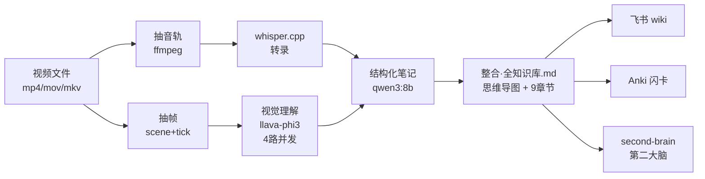

# video-to-knowledge-base

> 把任意视频文件（mp4 / mov / mkv）转换成本地知识库 —— **100% 本地**，**Apple Silicon Metal GPU 加速**，无需云端 API。

字幕 + 关键帧 + 视觉理解 + 结构化笔记 + 思维导图 + 概念速查 + 飞书推送 + Anki 闪卡，一条 pipeline 全部搞定。

[]()
[]()
[]()
[]()
[]()

---

## ⚡ 30 秒上手（macOS Apple Silicon）

```bash
# 一次性：装依赖 + 下载默认 whisper 模型（~514MB）
brew install ffmpeg whisper-cpp
mkdir -p ~/.cache/whisper.cpp
curl -L -o ~/.cache/whisper.cpp/ggml-medium-q5_0.bin \
  https://hf-mirror.com/ggerganov/whisper.cpp/resolve/main/ggml-medium-q5_0.bin

# 一键跑（本地处理 + 跳过飞书/Anki）
./scripts/pipeline.sh /path/to/video.mp4 --skip-feishu --skip-anki
```

输出在 `<视频目录>/<视频名>-知识库/`，主入口是 `knowledge/99-整合·全知识库.md`。

**性能（41 分钟 1080p 视频，M1 Pro）**：转录 4:45 + 抽音轨 3s + 抽帧 25s + 视觉理解 ~33 分钟（200 帧并发） + 笔记 ~10 分钟 = **完整流程 ~50 分钟**，仅转录 **5 分钟**。

---

## 🎯 它做什么



输入一个视频，输出：

- **字幕**：`captions/full.{srt,vtt,txt,csv,lrc,json}`（336 段）
- **关键帧**：`frames/*.jpg`（~200 张，按场景切换 + 90s 间隔）
- **视觉理解**：`vision/frame_manifest.json`（每帧的多模态描述）
- **结构化笔记**：`knowledge/02-结构化笔记.md`（9 章节）
- **思维导图**：`knowledge/03-思维导图.md`（Mermaid 格式）
- **整合版**：`knowledge/99-整合·全知识库.md` ★ **主入口**
- **Anki 闪卡**：可选生成并上传到本地 Anki
- **飞书推送**：可选同步到飞书知识库

---

## 📊 性能（实测数据，M1 Pro / 16GB / Metal GPU）

| 视频时长 | 转录（仅 step 3） | 完整流程（含视觉+笔记）|
|---|---|---|
| 5 分钟 | **~33 秒** | ~5 分钟 |
| 30 分钟 | ~3 分钟 | ~25 分钟 |
| 41 分钟 | **4:45** ⭐ 实测 | ~50 分钟 |
| 67 分钟 | ~8 分钟 | ~80 分钟 |

**模型选择**：

| 模型 | 41min 视频转录 | 中文质量 | 适用 |
|---|---|---|---|
| `ggml-tiny-q5_1` | ~30 秒 | ⚠ 不可用 | 仅英文短样本 |
| `ggml-small-q5_1` | **1:47** | ⭐⭐⭐ 漏段错字 | 极速先看 |
| **`ggml-medium-q5_0`** ⭐默认 | **4:45** | ⭐⭐⭐⭐ 略降 | 大多数场景 |
| `ggml-large-v3-q5_0` | ~8 分钟 | ⭐⭐⭐⭐⭐ 最高 | 重要内容 |

---

## 🔧 常用命令

### 模型选择

```bash
# 极速（牺牲质量）
./scripts/pipeline.sh video.mp4 --model-size fast

# 默认 medium（推荐）
./scripts/pipeline.sh video.mp4 --model-size balanced

# 最高质量（速度慢 1.8×）
./scripts/pipeline.sh video.mp4 --model-size quality
```

### 跳过某些步骤

```bash
# 只要字幕
./scripts/pipeline.sh video.mp4 --skip-frames --skip-notes --skip-feishu --skip-anki

# 只要本地处理，不要飞书/Anki
./scripts/pipeline.sh video.mp4 --skip-feishu --skip-anki

# 完整流程（含飞书 + Anki）
./scripts/pipeline.sh video.mp4
```

### 增量重跑（默认幂等）

```bash
# 第二次跑：跳过已存在的音频/字幕/帧（14 秒）
./scripts/pipeline.sh video.mp4 --skip-feishu --skip-anki

# 强制重跑所有步骤（覆盖）
./scripts/pipeline.sh video.mp4 --force
```

### 跑中间步骤

```bash
# 只跑转录（step 3）
./scripts/pipeline.sh video.mp4 --from-step 3 --to-step 3

# 跳过转录从笔记开始（需要已有字幕）
./scripts/pipeline.sh video.mp4 --from-step 5
```

### 保留 wav（默认转录后清理）

```bash
./scripts/pipeline.sh video.mp4 --keep-audio
```

---

## 📂 输出目录结构

```
视频名-知识库/
├── README.md                          # 本地入口
├── captions/
│   └── full.{srt,vtt,txt,csv,lrc,json}  # 6 种格式字幕（336 段）
├── frames/                            # ~200 张关键帧
├── vision/frame_manifest.json         # 视觉描述
├── knowledge/
│   ├── 00-帧索引.md                   # 帧按时间排序
│   ├── 01-完整转录稿.md               # 全文转录
│   ├── 02-结构化笔记.md               # N 章节书面笔记
│   ├── 03-思维导图.md                 # Mermaid
│   ├── 04-概念速查.md                 # 词条
│   ├── 99-整合·全知识库.md            # ★ 主入口
│   └── anki_cards.json                # Anki 导出
└── scripts/                           # 处理脚本副本（可重跑）
```

---

## 🧠 9 步 Pipeline 详解

| Step | 工具 | 输出 | 说明 |
|---|---|---|---|
| 1 | env_check.sh | — | 验证 ffmpeg / whisper.cpp / 模型 |
| 2 | extract_audio.sh | wav 16kHz | ffmpeg 抽音轨（~3 秒）|
| 3 | transcribe.sh | 6 种字幕 | whisper.cpp + Metal GPU（4 路并发）|
| 4 | extract_frames.sh | ~200 jpg | scene + 90s tick（自动去重到 200）|
| 5 | describe_frames.py | frame_manifest.json | ollama 4 路并发 |
| 6 | compose_notes.py | 6 个 md | qwen3:8b 主题切分 + 改写 |
| 7 | index_frames.py | 99-整合.md | 帧索引 + 整合 |
| 8 | push_to_feishu.sh | 飞书 wiki | 推送到飞书知识库（可选）|
| 9 | create_anki_cards.py | Anki deck | 生成 Anki 卡片 + 上传（可选）|

**外部模型（QoderWork 远程，推荐）**：Steps 5-7 用远程大模型，质量远超本地小模型。本地 ollama 仅作离线 fallback。

---

## ⚙️ 性能调优

| 调整 | 提速 | 副作用 |
|---|---|---|
| `-t 8` 线程全开 | 1.3-1.5× | 无 |
| `-p 4` 多 processor（默认）| 1.5-2× | RAM ~4GB |
| `--max-frames 200`（默认）| 防帧数爆炸 | 极端视频截断 |
| 模型 `medium`（默认）| ~1.8× | 中文错字略增 |
| 视觉理解 4 路并发 | ~50% 时间 | GPU 排队 |

**M1 Pro 16GB 推荐配置**（默认即最优）：`-t 8 -p 4` + `ggml-medium-q5_0` + `MAX_FRAMES=200`。

---

## 🔍 故障排查

跑 `./scripts/env_check.sh` 看哪个依赖缺。

| 问题 | 原因 | 解决 |
|---|---|---|
| 转录一直 0 输出 | 用了 Python whisper | 用 whisper-cli 二进制 |
| qwen3:8b 输出为空 | 默认 thinking 模式 | 用 `/api/chat` + `think:false` |
| 视觉描述幻觉 | llava-phi3 3.8B 太小 | 升 qwen2-vl 或手动 review |
| 抽帧 1000+ 张 | scene 阈值过敏感 | 用 `--max-frames 100` 限制 |
| whisper-cli timeout | 视频超 2.5h | 加 `--whisper-timeout 14400` |
| AnkiConnect 不可达 | Anki 未开 | 启动 Anki + 装 AnkiConnect |
| 飞书推送失败 | token 过期 | `lark-cli auth login` |

---

## ⚠️ 已知限制

- **平台**：当前在 **macOS Apple Silicon** 实测完整跑通。Linux 上 whisper.cpp + ffmpeg 工作，但 env_check.sh 部分 ollama 检测可能需要适配。
- **视频长度**：whisper medium/large 单次最多 ~2.5 小时。超长视频需要分段。
- **GPU 内存**：M1 Pro 16GB 上 medium + 200 帧是甜蜜点。更大模型/更多帧会 OOM。
- **网络**：仅在飞书/Anki/ollama 拉模型时需要；纯本地转录+抽帧+笔记可完全离线。

---

## 🔗 相关 Skills

| Skill | 用途 |
|---|---|
| `second-brain-ingest` | 把 `knowledge/*.md` 摄入第二大脑（强烈推荐）|
| `second-brain-query` | RAG 问答检索 |
| `second-brain-lint` | wiki 健康检查 |
| `source-management` | MCP 来源管理（标注转录来源）|

---

## 📦 依赖版本

- macOS 14+（Apple Silicon 强烈推荐）
- ffmpeg 8+
- whisper.cpp 1.7+
- ollama 0.18+（仅可选，用于视觉/笔记离线 fallback）
- Anki + AnkiConnect（仅可选）
- lark-cli（仅可选，飞书推送）
- Python 3.11+
- 磁盘：15GB 空闲（首次安装 + 模型）

---

## 📝 Changelog

### v2.0（最新）

**性能**：默认 medium-q5_0 + 4 路视觉并发，41 分钟视频完整流程 ~50 分钟（之前 ~80 分钟）

**安全性**：
- OUT_DIR 白名单（防止写到系统目录）
- env_check.sh 去 eval（防命令注入）
- pipefail + Python 退出码传播
- whisper timeout + 错误捕获 + 模型大小校验
- SRT/JSON 存在性检查（防静默失败）

**UX**：
- 默认幂等（第二次跑 14 秒），加 `--force` 强制
- 默认转录后清理 wav（节省 80MB），加 `--keep-audio` 保留
- 飞书孤儿节点自动清理
- 总 wall clock 打印（不再焦虑）

**可靠性**：
- scene 阈值 0.25 → 0.4（防 B 站讲解类 1000+ 帧爆炸）
- 加 `--max-frames N` 上限（默认 200，按时间均匀采样）
- 飞书推送：跳过已存在但为空的孤儿节点（不再永远写不进去）

### v1.0

初始 7 步 pipeline（环境检查 → 抽音轨 → 转录 → 抽帧 → 视觉理解 → 笔记 → 整合）

---

## 📄 License

MIT

---

**入口**：[SKILL.md](./SKILL.md) - Claude 自动加载的 skill 描述（包含触发关键词、内部接口、避坑指南）